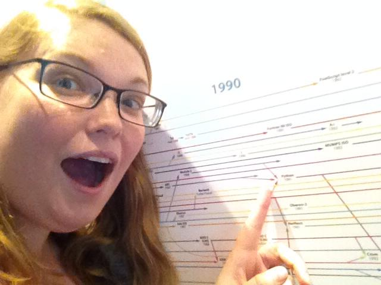
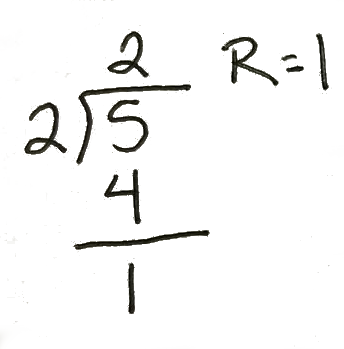
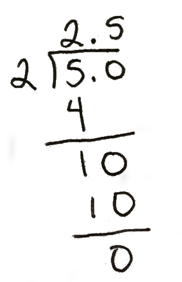

# Practical Programming, ALA-LITA workshop

## Welcome!!

<a href="http://nbviewer.ipython.org/github/elliewix/wickes-presentationfiles/blob/master/LITA-PracticalProgramming/PracticalProgramming-LITA.ipynb">NBViewer link to presentation materials</a>

Or do this:  http://goo.gl/3Lk9wk

## Schedule

* 8:30 - 9:00:  Introductions
* 9:00 - 9:30:  Software checks
* 9:30 - 10:00:  What are programming languages and what is Python?
* 10:00 - 10:30:  Talking through a programming problem
* 10:30 - 10:45:  Break!
* 10:45 - 11:30:  Data types, operators, and variables (oh my!)
* 11:30 - 12:00: Containers
* 12:00 - 1:00:  Lunch
* 1:00 - 1:30:  Working with files
* 2:00 - 2:30: Looping
* 2:30 - 3:00: Conditionals and working with data
* 3:00 - 3:30: Discussion on searching strategies (and buffer time)
* 3:30 - 4:00: Where to go from here

# Pre-introduction task!

Start downloading PyCharm Educational Edition <a href="https://www.jetbrains.com/pycharm-educational/">Download here</a>

Start the install process if you feel comfortable with it.  Tip:  all the standard stuff is fine.  Just click 'okay' a bunch.

# Who am I?

Elizabeth Wickes

Various types of contact info:

* wickes1@illinois.edu
* <a href="http://www.elizabethwickes.com">elizabethwickes.com</a>
* <a href="https://twitter.com/elliewix">@elliewix</a>

Metadata:

* GSLIS (UIUC) Master's student in data curation and socio-technical data analytics
* Center for Informatics Research in Science and Scholarship (CIRSS) RA
* Co-organizer of the Champaign-Urbana Python User's Group (Py-CU)
* Pro bono data monkey

# Teaching Style

I want to take a moment to talk about my teaching style before we start really diving into the programming content.  

* I will make you talk, but usually as a group.
* I will try to keep you focused on practicing your vocabulary for these new concepts.
* I will try to 'prime' you for certain concepts that will be coming up.
    * Some of this may be introducing a concept that we will build on.
    * Feel free to mentally check out in portions of the highly theoretical stuff.
* There are no stupid questions:
    * Only things I haven't explained yet, or explained poorly.
    * Feel free to stop me if I'm being confusing.
    * But I reserve the right to say that I'm getting to that :-)
* We're all students and peers in this room.
* Let me know if there are learning needs I can accommodate.

This is a practical programming workshop, so I'm going to stick to the skills that I feel are vital for jumping into projcts.  However, this does not mean that we should skip over certain theoretical discussions.  If I'm talking about theoretical concepts it is because I feel like you need it.  This also means that I will be skipping over some more non-essential topics because you can pick them up on your own later.

# And you?

* Name
* Institution
* What brings you here?
    * Curiosity?  Specific project?
* What experience in programming do you have?

## Software Checks!

### Mac Users

You're set!  You already have Python on your system. We're still going to start you off with PyCharm, but I can show you other programs that would also be good to know about.

### Windows users

Go ahead and install PyCharm.  It should install Python as part of it.  We can go over some other tools at the end as well.

# Topic 1: Historical overview of programming languages

## Computers are amazing tools, but they aren't magic

* Every computer has a specific language.
* We need to be able to tell computers what to do, but in a way that we can speak.

<iframe src=http://en.wikipedia.org/wiki/List_of_programming_languages width=700 height=350></iframe>

## Programming languages can be classified into groups

We're librarians, we like ontologies, right?

*Very* roughly, programming languages can be described by their purpose and their style.


* Purpose:
    * Web languages (HTML, PHP, JavaScript, etc...)
    * Scripting (Python, Perl, R, etc...)
    * Software languages (Java, C++, etc...)

* Style:
    * Language syntax
    * Abstraction level
    * Methodological approach
    * etc...

## That's neat, but what about Python?

Python is a modern programming language and is the language of this workshop.  In this description universe, we can describe Python as:

* A general purpose programming language, most commonly used for scripting
    * But with growing web and software usage
* A very high level language designed for clarity of expression

## What is Python?



(A selfie with Python on the history of programming languages at the <a href = "http://www.tnmoc.org/">The National Museum of Computing</a> in Bletchley Park, UK. 

## Points of interest in the Python biography

* Created by Guido van Rossum
    * Who is now the <a href='http://en.wikipedia.org/wiki/Benevolent_dictator_for_life'>Benevolent Dictator for Life (BDFL)</a>
* Is open source
    * Community maintained
    * Features created by its users
        * Adapts quickly to industry needs
    * Free to use
    * Consensus based development
* Based on the C language
    * Everything written in Python is translated to C before being executed.
    * This does make execution technically slower than in C, but this is rarely a problem unless you're doing scientific computing.
* Was designed with a philosophy
    * And this design philosophy is maintained by the community.


```python
>>> import this
```

    The Zen of Python, by Tim Peters
    
    Beautiful is better than ugly.
    Explicit is better than implicit.
    Simple is better than complex.
    Complex is better than complicated.
    Flat is better than nested.
    Sparse is better than dense.
    Readability counts.
    Special cases aren't special enough to break the rules.
    Although practicality beats purity.
    Errors should never pass silently.
    Unless explicitly silenced.
    In the face of ambiguity, refuse the temptation to guess.
    There should be one-- and preferably only one --obvious way to do it.
    Although that way may not be obvious at first unless you're Dutch.
    Now is better than never.
    Although never is often better than *right* now.
    If the implementation is hard to explain, it's a bad idea.
    If the implementation is easy to explain, it may be a good idea.
    Namespaces are one honking great idea -- let's do more of those!


## Python can be said to be...

* General purpose
* Platform independent
* An industry standard
* <a href = "http://cacm.acm.org/blogs/blog-cacm/176450-python-is-now-the-most-popular-introductory-teaching-language-at-top-us-universities/fulltext">Currently the most popular language for introductory classes</a>

It does this by being:

* Interpreted
* Strongly typed
* Dynamic
* .... ugh .....

Let's get a chart out.  A lot of this chart will make more sense as we work through the material, so just try to keep the general concepts in mind and expect some fuzziness.


* x-axis - Explicitness:  Are datatypes able to dynamically change or must they be declared before use?
* y-axis - "Will it blend?":  Does the language allow different datatypes to work together or does everything have to be the same?


## How did we get to Python?

There is a fantastic history to this development, but a lot of the detail is beyond the scope of this workshop.  So I will stick to summing up the relevant facts that have gotten us to this point.

Early computer languages started out very close to the computer's own language and were written for specific systems.  This made sense for the time, but was really hard.  These languages involve encoding both the "what" and the "how" with the instructions.  Early computer languages were far removed from human language.


So what do I mean by very close to the computer language?  Let's try this situation:  Tell me how to walk across the room.

* How we want to do it:  "Walk to that spot over there."


However, this is presuming that I know how to walk.


* How those old languages would do it: 
    * Pick up your left foot
    * Move it forward
    * Place it down
    * Steady, pause
    * Pick up your right food
    * Move it forward
    * ...etc... You get the idea

The evolution of these languages has taken a path of specialization, although almost all languages are moving further away from this highly explicit machine code. Various languages focused on data storage, business, or pure logic, and each of these contained more implicit knowledge, so that the programmer did not have to explictly define every single step of an operation.

There have been a lot of languages, and new languages continue to be developed.  Of course, the development has been mostly by English speaking researchers and programmers, so the most commonly used langauges are very English-like.  But that's a story for a different conference...

## How do we talk about programming languages?

### Purpose and style

Every language can be described in terms of the usage purpose and linguistic style.  

#### Purpose

Programming languages exist for a reason or were created for a purpose.

* A specific problem
* An unfilled tool niche
* As a beginner's learning langugage

Examples:

* PHP: initially created as someone's personal tool for websites and databases and has grown into a commercially used tool.
* Python:  A hobby project that was started over the Christmas holidays.  Grew out of a philosophy about code.
* Ada: Written to a US Department of Defense specification for use in military hardware, especially aviation. Designed to be highly robust so that planes don't fall out of the sky.


#### Style

Every language has a formal syntax for expressing ideas and actions.

* Modern languages have nouns and verbs:  things and actions.
* Some languages were explicitly created to express the syntax of formal logic.
* Even though some keywords may look like English, that doesn't always mean the words make sense for what they actually do.
    * `with` and `for` are good examples of this.  We'll be learning about each today.


## How do we talk about programming languages?

### Purpose and style

Every language can be described in terms of the usage purpose and linguistic style.  

#### Purpose

Every language has a reason for existence.  Someone came up with it for a reason.  PHP is an interesting example of how the origins significantly influence the current usage.  PHP is one of the most commonly used langauges for dynamic websites was created by Rasmus Lerdorf for his own website and projects.  Having satisfied a need niche, others began asking to use the tool as well and adoption  grew to include even commercial enterprises.  However, because it was originally created as a personal project, there were little to no standards in place, and the language suffers from it's disorganized origins.

While most languages can be adapted to nearly any type of prgammatic task, there are usually tasks that it has been optimized for.  For example, PHP is framed to deal with websites and connections to databases.  While it can be used for text processing purposes, it isn't exactly optimal or easy to do complex text processing tasks with it.  Python, however, has been extended with packages to be a powerful web language, but is highly optimized for working as a basic scripting language and includes excellent build in data and text processing tools.  Java, for example, lacks built in CSV reader libraries.

#### Style

We call programming languages "languages" because they are exactly that.  Each has a formal syntax for expressing actions and statements.  As I mentioned before, most commonly used programming languages are based around English.  However, this doesn't mean you should expect all of the vocabulary in those languages to make logical connections to English use.  Keywords will generally appear English-like or be real English words, but may be used in strange ways from what you expected.  Keep an open mind and put on your 'language learning hat' while going through this workshop.

Remember that in our introductory courses we often started by simply memorizing certain phrases and formulas before diving deep into what the core syntax meant.  This is very much also true of programming languages.

## History of programming languages

Things to look for in this chart:

* Every language is connected to or influenced by another language.
    * Sometimes this is due to a new language evolving directly out of an older one.
    * Other times the creator can describe their influences for their design choices.
* Knowing how a language was created is helpful as you move forward in learning other languages.
* There are a lot of languages in active use.
    * This speaks to the specialization that has occured in our modern era.
    
<a href = 'http://hightechhistory.files.wordpress.com/2010/04/history-poster20.gif'></a>

## The modern programming languges

This image provides an interesting overview of how these languages are used in industry.

Note that Python is an industry standard language.

<a href = 'http://cdn2.carlcheo.com/wp-content/uploads/2014/12/which-programming-language-should-i-learn-first-infographic.png'>This image is way too big to display here.  Click!</a>

# Working through a programming problem

Let's work through a problem just using your own language.

Task:  Write a set of rules for assigning a letter grade to a numerical score.

Write out the rules using whatever natural language you are comfortable with.

Be sure to think about:

* What kind of input are you expecting?
* What are 'good' values and what are 'bad' values?
    * Should you handle bad values differently?
* Are all 'good' values supported?

Take about 10 minues to brainstorm.  Feel free to work on groups and ask each other questions.

## Test values

* 101
* 99.9
* 70
* 49
* 0
* 100
* -1
* 150

## What solutions did we come up with?

## Example in Python

<a href = "https://trinket.io/library/trinkets/19793572bd">Link to an example version</a>

## What we came up with in class

* 0-100 scale, no extra credit

* F: >= 0 and < 59.5
* D:  >= 59.5 and < 69.5
* C:  >= 69.5 and < 79.5
* B:  >= 79.5 and < 89.5
* A:  >= 89.5 and <= 100

* Greater than 100: Error
* Less than 0:  Error
* Anything not a number: error


# Break time!

# Topic 2: Nouns (objects/data types) and verbs (operators)

How does a computer understand the world?  Always keep in mind that everything is just 0s and 1s.  We, as humans, can look at things and recognize their content.  Computers cannot do this.  They depend on us telling them what things are.

## Objects

Everything in Python is an 'object.'  This is actually a very technical statement that we will expand and clarify as we go throughout the workshop, and something that you will continue to explore as you learn more about programming.  I don't expect you to completely grasp what this concept means, so the purpose of this discussion is to just introduce the basic framework that we can explore more later.

### Object what now?

<a href = 'http://www.oxforddictionaries.com/us/definition/american_english/object'>Oxford English Dictionary</a> has a definition:  "A person or thing to which a specified action or feeling is directed"

This is the meaning that we want to focus on.

Let's take a look at a book.  What can we do with a book?

* Read it
* Catalog it
* Preserve it

What information does a book have?

* A title
* A certain number of pages
* A summary of content
* An author

There are actions that can be taken on books.

* Read them
* Write in them
* Copy them
* etc.

## Objects slide notes

Would we eat a book?  Would we write with a book?  Not really.  Going back to our definition, we can see that an object can receive actions.  I can read a book.  I can look up the book's title.  However, there are actions that I can't do to it.  Every object, in this sense, can hold a set of actions and values.

And that's the key phrase that I want you to keep in mind as we go through this workshop.  Every object within Python, and we'll talk about what those are in a moment, is capable of receiving certaint types of actions and holding certain types of information.  Of everyhting that I've said in the past few minutes, that's the take-away phrase that I want you to hold in your mind.

## Prepare for the programming Autobahn here...

I'm going to dive straight into data types and operators.  These are the basic elements used to write Python programs.  Once we get through this section, you know enough vocabulary to start learning how to do the neat things.

Buckle up, we're going to zip through this.

Remember, focus on listening and ingesting the concepts rather than writing down all the terminology.  The keywords will be repeated and you can always reference the slides as we move forward.

## Python's core data types (or core to the beginner interested in data)

Going back to our analogy to human language, these data types are basically the types of nouns that we can have in our sentences.  They are the things that we talk about, the things that we do actions to.  There are actually a ton of different data types within Python, but I'm going to cover just the core ones that you need to care about immediately.  You'll pick up the other types as you do more, and most of the others are built on top of what I will be talking about.

There are four groups this workshop will cover:  numbers, words, booleans, and containers.  The current section will cover the first three. A special section on containers will come later.

We're going to meet our first helpful Python tool:  `type()`.  Throw something inside the `()` and Python will tell you what type of object it is seeing. The technical word for these tools are functions. We'll describe functions in more detail later.

We're going to cover the big three now:

* Numbers
* Words
* Booleans

## Numbers

Computers represent and store numbers differently than humans.  Languages like Java actually have five different numerical data types.  Python (at least in everyday use) only requires programmers to deal with two numerical datatypes. Why would we need more than one way to store numbers in the first place?

This has to do with the legacy of early computing and how computers store data in memory. The key fact is that storing some kinds of numbers takes up less memory than other types of numbers.  With 64 units of memory space, practically any number can be stored. However, not all numbers need that much space. The vast majority of numbers only need 16 units of memory space. 

Recall our earlier discussion about how early computer languages were closer to the computer's internal structure. When memory was very limited and expensive, allowing a number to take up more memory than necessary could render a project impossible from an engineering or budgetary perspective.  Programmers gained a real benefit from the variety of numerical data types that allowed them fine control over how much memory to allocate for each number they needed to store.

Compared to the early days of computing, the amount of memory available in today's computers is incredibly huge and cheap (though not infinite!) Programmers can afford to be more relaxed when it comes to managing memory. Python is also better than early languages at automatically deciding how much memory is needed to store a given number and so takes care of much of this in the background for us.  However, there are still two different numerical data types that we need to remember:

* integers (whole numbers)
* floating point number (decimal numbers)

### Integers:  Whole numbers

The `int` type, short for integer, is used for whole numbers, numbers without any decimal points.  


```python
1 + 1
```


    2


```python
type(1)
```


    int


### Floating point numbers:  Numbers with decimal values

The `float` type, short for floating point number, is any number with a decimal value.


```python
1.5 + 2.5
```


    4.0


```python
1.5 + .3
```


    1.8


```python
type(1.5)
```


    float


### Interaction of `int` and `float`

`int` and `float` numbers get along pretty well, but there are some aspects which you might find surprising. We'll go into more detail about this later.  (You haven't met some of these operators yet, but you can understand the basics!)


```python
1 + 0.4
```


    1.4


```python
4 - .1
```


    3.9


```python
type(1)
```


    int


```python
type(1.0)
```


    float


```python
1 == 1.0
```


    True


## Words

Words are pretty simple here.  All the basic characters you see, the ones you can see and type on your keyboard, are represented as characters.  These characters can be strung together as strings! (pun intended)

### Strings

The `str` type, short for string, contains character data.  There are three ways to indicate that something is a string.


`"like this, with double quotes"`

`'or like this, with single quotes'`

`""" or use`<br>
`three double quotes`<br>
`together to make`<br>
`a multi-line string"""`

Feel free to use either ' or ", but try to be consistent.  The multi-line string is generally used either for certain types of documentation modes.


### Why do we need three different ways to write strings?


```python
print "Feel free to use either single or double quotes"

print 'You just need to make them match.'
```

    Feel free to use either single or double quotes
    You just need to make them match.


### So what if you need to put a double quote in a string?


```python
print "You can escape it out, like this: \" see the backslash?"
```

    You can escape it out, like this: " see the backslash?


### Remember that the quotes tells Python that something is a string


```python
type("1")
```


    str


```python
type(1)
```


    int


```python
1 == "1"
```


    False


# String operations

## Navigating a string

Strings can be sliced, meaning that subsections can be accessed.  The slicing notation is:

`string[start:stop:step]`

* `start` is the index position to start at
    * Assumes start if omitted
* `stop` is the index position to stop at
    * Assumes end if omitted
* `step` is how many positions to move over
    * Assumes 1 if omitted
    
Let's open up your interactive session and test this out.


```python
print "hello"[:] # everything
print "hello"[0:len("hello")] # also everything
print "hello"[::2] # skip every other letter
```

    hello
    hello
    hlo


```python
print "hello"[0] # first letter
print "hello"[-1] # last letter
```

    h
    o


```python
print "hello"[0:2] # yup, indexing starts at 0
```

    he


You try a few on your own:

* get just the l's
* skip every three letters

Anything else neat?

## Boolean values

These are the data types that we use to investigate things.  There are only two values to remember:

* `True`
* `False`

You should recall seeing these appear in some of our previous examples.

### Checking for true and false in programs

Many times we want to check if something equals another thing.  For example:

* Is this a title that I have seen already?
* Was this word found more than 100 times?
* Is the length of the word longer than 10 characters?

These are all questions that we might need to ask in our programs.  The answers we receive come in the form of `bool` objects (`True` and `False`).

That's pretty much everything you need to know!  Let's look at some examples:

(again, there is some notation here that you haven't met before, but you will soon)


```python
1 == 1
```


    True


```python
5 < 10
```


    True


```python
len("foo") > 5 # len() checks the length of whatever you pass it
```


    False


We'll meet up again with boolean types when we get into conditionals.

## Switching gears...

Now that we know the basic data types for our content, let's talk a little bit about operators and how to perform operations on these data types.  Then we'll talk about containers in the next section.

### Operators

Now that we know a little bit about the nouns that we use within our programs, let's start exploring some of the verbs.

Operators are the most basic actions that we can take on objects.  These comprise mostly the traditional math operations that you remember from elementary school, but some can be used outside of math concepts.

### The basic operators


| Operator |                       Numeric Operation                       | Example |
|:--------:|:-------------------------------------------------------------:|:----------------:|
| +        | Addition                                                      | `>>> 2 + 5` <br> `7` | 
| -        | Subtraction                                                   | `>>> 2 - 5` <br> `-3` | 
| *        | Multiplication                                                | `>>> 2 * 5` <br> `10` | 
| **       | Exponent                                                      | `>>> 2 ** 5` <br> `32` | 
| /        | division <br>Python2.\*: floor division<br>Python 3.\*: true division | `>>> 2 / 5` <br> `0`<br>`>>> 2. / 5.` <br> `0.4` | 
| //       | floor division<br>both 2.\* and 3.\*                            | `>>> 2 // 5` <br> `0`<br>`>>> 2. // 5.` <br> `0.0` | 
| %        | modulo<br>(returns the remainder)                                | `>>> 2 % 5` <br> `2`<br>`>>> 4 % 2` <br> `0` | 

### Extended discussion on division

Division in Python 2 and Python 3 works differently.

* True division
    * This is division that includes the full decimal value.
    * When we say "division" we generally mean "true division"
* Floor division
    * This type of division removes whatever that decimal value is and returns the integer.

To get true division in Python 2:

* Convert your ints into floats
* Use `from __future__ import division`


```python
2 / 5
```


    0


```python
2. / 5.

```


    0.4


```python
from __future__ import division

2 / 5
```


    0.4


### Modulo?

Referred to as 'mod', modulo returns the remainder of your division value.

Remember the parts of a division calculation:

* Quotient
    * The 'whole number' value
* Remainder
    * What is 'left over'
    
What is reutned from modulo is not the decimal value!


```python
5. / 2.
```


    2.5


```python
5 % 2
```


    1


#### Remainders and decimals in context

(AKA: Elizabeth suffered through elementary school flashbacks to make this slide)

  

## More operators

The concept of 'overloading' in programming means that the same name or symbol may be used in multiple contexts.  Some of the operators that we just learned about will work with other data types than numbers.


```python
"a" + "a"
```


    'aa'


```python
"hello" * 4
```


    'hellohellohellohello'


```python
"hello" + " " * 5 + "world"
```


    'hello     world'


Can you create a concatenation of the first and last letters of `"hello"`?

# Variables

So now that we can do some neat things with objects and operations, let's start talking about variables.

Sometimes we need to give things name.  For example, if a value will be repeated throughout a program you might want to just name it so you can ask for it later.

Imagine mad libs. It asks you for nouns, names, verbs, adjectives, etc.  You supply them, and then a story is built from those values.


```python
name = "Dani"
color = "teal"
noun = "cat"
```


```python
print name + " asked me, \"So what kind of " + noun + " do you want?\""
print "I don't know what kind of " + noun + " I want!  Who wants a " + color + " " + noun + "?"
print "So I just said, \"Give me whatever kind of " + color + " " + noun + " you have in stock, " + name + "\""
```

    Dani asked me, "So what kind of cat do you want?"
    I don't know what kind of cat I want!  Who wants a teal cat?
    So I just said, "Give me whatever kind of teal cat you have in stock, Dani"


Let's explore this more in PyCharm.

Tasks:

* Change the values a few times
* Add a number in here
    * Example:  "Who wants 8 teal cats??"
* Add an adjective
    * Example:  "Who wans 9 fizzy cats?"
    
Remember that you need `+` between all your elements.
Just use one `=` sign for assignment.
Be sure that your quotes match on either side.


# Containers in context

Can we automatically generate madlibs using this base?

* A list of many colors to choose from
* Randomly choose any number
* A list of several nouns to choose from

We need some way to keep each of these lists together.

Python has a convenient data type, called the `list`.

## Containers

We need a way of storing data, or objects, within our program.  This allows us to group things together.  So, let's meet Python's `list`.

Lists are the most basic type of container.  Imagine a list you might make, like a grocery list.

* You can fill it with anything, although there is usually a theme.
* There is an order, although sometimes it may be kind of arbitrary.

On a more technical level:

* Lists are contained within `[]` (square brackets).
* Items in lists are separated by commas.


```python
print [] # this is an empty list
print ["cat", "dog", "shark"] # a list of nouns
print ["red", "yellow", "green", "blue"] # a list of colors
```

    []
    ['cat', 'dog', 'shark']
    ['red', 'yellow', 'green', 'blue']


## The `random` library

The `random` library happens to have a neat utility:  `random.choice()`.  This is the first real function that we're going to explore in depth.

What does the documentation say?

* random.choice(seq)
    * Return a random element from the non-empty sequence seq. If seq is empty, raises IndexError.
    
This function will choose a random element from a given container.  We need to "pass" `random.choice()` a container.  This just means that we need put our container inside of the `()`.


```python
import random

names = ["Elizabeth", "Dani", "Fizzpop"]
nouns = ["cat", "dog", "shark"]
colors = ["red", "yellow", "green", "blue"]

name = random.choice(names)
noun = random.choice(nouns)
color = random.choice(colors)

print name + " asked me, \"So what kind of " + noun + " do you want?\""
print "I don't know what kind of " + noun + " I want!  Who wants a " + color + " " + noun + "?"
print "So I just said, \"Give me whatever kind of " + color + " " + noun + " you have in stock, " + name + "\""
```

    Dani asked me, "So what kind of shark do you want?"
    I don't know what kind of shark I want!  Who wants a green shark?
    So I just said, "Give me whatever kind of green shark you have in stock, Dani"


Try running a script with this a few times.  The number will keep changing.

## Helpful `list` code formulas

Let's start with a list of assorted candy colors.


```python
bowl = ['red', 'blue', 'red', 'red', 'green', 'yellow', 'brown', 'red', 'yellow', 'brown', 'green']
```


```python
# how many elements are in it?
print len(bowl)
```

    11


```python
# what are the unique values?
# the set() family of objects are great for doing this kind of work
uniques = set(bowl)
print uniques
print type(uniques)
print len(uniques)
```

    set(['blue', 'brown', 'green', 'yellow', 'red'])
    <type 'set'>
    5


```python
# let's turn that back into a list
uniquelist = list(uniques)
print uniquelist
print type(uniquelist)
```

    ['blue', 'brown', 'green', 'yellow', 'red']
    <type 'list'>


## `list` slicing

Let's open up your IDLE client so you can try this out yourself!  PyCharm will work, too, but might be a bit weird.

A `list` has an ordered index.  This means we can access elements via their their index position.

* Slicing notation for a single element:
    * `list_name[index_position]`
* Slicing notation for a range of elements:
    * `list_name[start:stop:step]`
    
Various warnings:

* Index positions start at `0` and NOT `1`.  
    * Be very careful.  It will take some time to get used to this.
* `step` value is inclusive
* `stop` position is exclusive
    * This means it will go "up to but not including that position"
* `step` means "how many elements should I step through at a time?"
* `start`, `stop`, and `step` are each optional, but the `:` should be retained to indicate what is being omitted.

Let's switch to a list that will give us more informative feedback.  You'll just need to memorize many of these notation tricks, so don't feel at a loss that you weren't able to derive them on your own.


```python
word_numbers = ['one', 'two', 'three', 'four', 'five', 'six', 'seven', 'eight', 'nine', 'ten']
print len(word_numbers)
```

    10


```python
print word_numbers[0] # the first element
print word_numbers[-1] # the last element
```

    one
    ten


```python
print word_numbers[0:3] # the first four three elements, remember that stop is exclusive
print word_numbers[:3] # start is optional if I mean for it to start at the beginning
```

    ['one', 'two', 'three']
    ['one', 'two', 'three']


```python
print word_numbers[6:len(word_numbers)] # start at the seventh element and go to the end
print word_numbers[6:] # same thing, but 'go to the end' implied by omission
```

    ['seven', 'eight', 'nine', 'ten']
    ['seven', 'eight', 'nine', 'ten']


```python
# stepping
print word_numbers[::2] # every other element
print word_numbers[::-1] # go backwards through everthing
```

    ['one', 'three', 'five', 'seven', 'nine']
    ['ten', 'nine', 'eight', 'seven', 'six', 'five', 'four', 'three', 'two', 'one']


```python
print word_numbers[11] # get used to seeing 'list index out of range' errors
```


    ---------------------------------------------------------------------------
    IndexError                                Traceback (most recent call last)

    <ipython-input-28-75a0c08ae074> in <module>()
    ----> 1 print word_numbers[11]
    

    IndexError: list index out of range


## Dictionaries

Let's take a look at another type of container:  the dictionary (`dict`).

The `list` container we just learned about contains just a plain list of elements.  However, `dict` is meant to contain a set of key/value pairs.  These are stuctures meant to hold data values that are looked up via their keys.  Imagine these are mini databases.

Dictionaries:

* have no particular order (no position index values)
    * this means that the order will change when you print the dictionary
    * do not depend on the order to be the same
* value are looked up by the keys
* keys and values may be any object
    * including other `list`s or `dict`s, but be careful when doing this!


For example, let's imagine we have a bowl of randomly colored candies.  We can model this inside a list this way:


```python
bowl = ['red', 'blue', 'red', 'red', 'green', 'yellow', 'brown', 'red', 'yellow', 'brown', 'green']
```

We can investigate and do a few things to our bowl.


```python
print len(bowl)  # the list has 11 elements
print type(bowl) # indeed, it is a list
bowl.append('green')
bowl.append('yellow') # I can add items
print len(bowl) # and then see that the length has increased
```

    11
    <type 'list'>
    13


We can visually inspect the list and know that there are repeats of the colors within it.  So what if we wanted to count how many of each color there were in the list?

Python 2.7 and later has a great feature, called Counter().


```python
from collections import Counter # import Counter into our namespace
```


```python
counted_bowl = dict(Counter(bowl)) # I'm converting this back to a dictionary, we'll talk about that later!
print counted_bowl
```

    {'blue': 1, 'brown': 2, 'green': 3, 'red': 4, 'yellow': 3}


We can see the key/value pairs in this dictionary.  

The notation: `'blue': 1` means that the key of `'blue'` has the value of `1`.

## Helpful `dict` formulas


```python
print counted_bowl.keys() # get a list of all the keys
print counted_bowl.values() # get a list of all the values
print sum(counted_bowl.values()) # because this is returning a list, I can sum the total values
```

    ['blue', 'brown', 'green', 'red', 'yellow']
    [1, 2, 3, 4, 3]
    13


```python
print counted_bowl['brown'] # look up a value with a key
```

    2


```python
print 'red' in counted_bowl # check if a key exists in a dictionary
```

    True


```python
counted_bowl['fuzzy'] = 0 # adds a new value if the key does not exist
counted_bowl['red'] = 2 # change a value if the key does exist
print counted_bowl
```

    {'blue': 1, 'brown': 2, 'yellow': 3, 'green': 3, 'fuzzy': 0, 'red': 2}


## Python data structure documentation

Have this page bookmarked or know how to get to it.  Take some time later to look through the examples, and be sure to reference this page when you encounter something new that you need to do.<br><br>

<iframe src='https://docs.python.org/2/tutorial/datastructures.html' width=900 height=350></iframe>

# Looping and white space

Most of your programs are going to be centered around a loop.  Below are two formulas for printing out all the contents of a list.

This is also a great time to talk about white space.  The indented code under the line beginning with `for` means that it belongs to that `for` block.  Some programming languages use punctuation, like `{}`, to indicate what code belongs to that block.  However, Python uses this white space to indicate block membership.  I'm going to briefly touch on these and then move right into reading files, because looping is an essential element of working with that data.


```python
# do something to all those things
for number in [1, 2, 3, 4, 5]:
    print number
```

    1
    2
    3
    4
    5


```python
# do something so long as this condition is or is not met
numbers = [1, 2, 3, 4, 5]
count = 0
while count < len(numbers):
    print numbers[count]
    count = count + 1
```

    1
    2
    3
    4
    5


## The for loop

When working with data, the `for` loop will be what you use the most often.  Here is the basic syntax:


```python
for iterable_variable in iterable_item:
    print iterable_variable # or do whatever action you wanted...
```


```python
for candy in bowl:
    print "The bowl has a " + candy + " in it."
```

    The bowl has a red in it.
    The bowl has a blue in it.
    The bowl has a red in it.
    The bowl has a red in it.
    The bowl has a green in it.
    The bowl has a yellow in it.
    The bowl has a brown in it.
    The bowl has a red in it.
    The bowl has a yellow in it.
    The bowl has a brown in it.
    The bowl has a green in it.


A common tasks that often comes up is: "Do this task some arbitrary number of times."  For example, "Fill a bowl with 50 random candies."  A canonical method of doing this is to use the function `range()`.


```python
print range(10) # range is a function to return lists of arbitrary length
```

    [0, 1, 2, 3, 4, 5, 6, 7, 8, 9]


```python
for each in range(5):
    print "I did a thing"
```

    I did a thing
    I did a thing
    I did a thing
    I did a thing
    I did a thing


```python
for each in range(5):
    print "I don't have to do anything with it, but the value of each is " + str(each)
```

    I don't have to do anything with it, but the value of each is 0
    I don't have to do anything with it, but the value of each is 1
    I don't have to do anything with it, but the value of each is 2
    I don't have to do anything with it, but the value of each is 3
    I don't have to do anything with it, but the value of each is 4


## `while` loop

This look should be used when you don't know how many times something needs to be run.  This statement requires a bit more set up, with incrementing a counter.


```python
import random
sum = 0
target = 100
count = 0
while sum <=20:
    sum += random.randint(0,10)
    count += 1
    print sum
print "counted to",sum,"in",count,"steps"
```

    3
    11
    13
    19
    20
    30
    counted to 30 in 6 steps


## Infinite loops

There is a pretty big danger of opening up an infinite loop.  This a loop that never ends.  For example, what if I had forgotten to increase count by the value?  It would then always be less than or equal to 20, so the program will never stop running.

Ways to get out of an infinite loop:

control+c will kill it (yes, mac users, control even for you).

# Files

This bit of code will create a text file with 1,000 random colors.  Each color on a newline.  Let's start reading through this file, and then we'll return to this code.


```python
import random

colors = ['red', 'blue', 'green', 'orange', 'fuzzy']

with open('colors.txt', 'wt') as writecolors:
    for i in range(1000):
        color = random.choice(colors)
        writecolors.write(color + '\n')
```

## Reading a file

`filename = 'filename.txt'` This is just the text value of the file path.

To open and read a text file:

`my_file = open(filename, 'rt')`  This creates your file object.
`my_text = my_file.read()`  This reads the text values from the file object.
`my_file.close()`  This closes the file.  A weird, but important concept.

Alternative syntax:

`with open(filename, 'rt') as my_file:`<br>
&nbsp;&nbsp;&nbsp;&nbsp;&nbsp;&nbsp;&nbsp;&nbsp;`my_text = my_file.read()`

`with` has the advantage of taking care of opening and closing the file for you.  Once it exists the `with` block, the file is closed and everything is done.


```python
filename = 'colors.txt'
my_file = open(filename)
my_text = my_file.read()
my_file.close()
```


```python
my_text[:100] # let's just look at the first 100 characters
```


    'green\ngreen\nfuzzy\nred\ngreen\nblue\nblue\norange\ngreen\norange\nblue\norange\norange\nred\ngreen\norange\nfuzzy\n'


So what do we want to do with this?  Maybe count how many times each color is in?  I always prefer to use `with` when possible.

The Python documentation has a list of methods for files.  We've already seen `read()`, but there is also `readlines()`.  This method will turn the 


```python
filename = 'colors.txt'
with open(filename, 'rt') as my_file:
    colors = my_file.readlines()
```


```python
print colors[:100]
```

    ['green\n', 'green\n', 'fuzzy\n', 'red\n', 'green\n', 'blue\n', 'blue\n', 'orange\n', 'green\n', 'orange\n', 'blue\n', 'orange\n', 'orange\n', 'red\n', 'green\n', 'orange\n', 'fuzzy\n', 'red\n', 'orange\n', 'red\n', 'red\n', 'orange\n', 'orange\n', 'green\n', 'orange\n', 'red\n', 'fuzzy\n', 'blue\n', 'fuzzy\n', 'green\n', 'fuzzy\n', 'fuzzy\n', 'red\n', 'orange\n', 'orange\n', 'orange\n', 'orange\n', 'orange\n', 'orange\n', 'green\n', 'orange\n', 'red\n', 'red\n', 'orange\n', 'fuzzy\n', 'red\n', 'green\n', 'blue\n', 'green\n', 'green\n', 'green\n', 'red\n', 'fuzzy\n', 'green\n', 'green\n', 'green\n', 'red\n', 'blue\n', 'fuzzy\n', 'blue\n', 'blue\n', 'green\n', 'blue\n', 'red\n', 'red\n', 'red\n', 'fuzzy\n', 'blue\n', 'blue\n', 'red\n', 'red\n', 'fuzzy\n', 'orange\n', 'red\n', 'orange\n', 'fuzzy\n', 'orange\n', 'fuzzy\n', 'blue\n', 'orange\n', 'green\n', 'red\n', 'fuzzy\n', 'blue\n', 'green\n', 'green\n', 'green\n', 'red\n', 'green\n', 'orange\n', 'blue\n', 'green\n', 'blue\n', 'orange\n', 'red\n', 'orange\n', 'blue\n', 'blue\n', 'blue\n', 'red\n']


Neat!  But what about all those newlines...  Let's meet `strip()`. This will automatically clean off white space and other crud from the left and right sides of a string.


```python
clean_colors = []

for color in colors:
    clean_color = color.strip()
    clean_colors.append(clean_color)
```


```python
print clean_colors[:100]
```

    ['green', 'green', 'fuzzy', 'red', 'green', 'blue', 'blue', 'orange', 'green', 'orange', 'blue', 'orange', 'orange', 'red', 'green', 'orange', 'fuzzy', 'red', 'orange', 'red', 'red', 'orange', 'orange', 'green', 'orange', 'red', 'fuzzy', 'blue', 'fuzzy', 'green', 'fuzzy', 'fuzzy', 'red', 'orange', 'orange', 'orange', 'orange', 'orange', 'orange', 'green', 'orange', 'red', 'red', 'orange', 'fuzzy', 'red', 'green', 'blue', 'green', 'green', 'green', 'red', 'fuzzy', 'green', 'green', 'green', 'red', 'blue', 'fuzzy', 'blue', 'blue', 'green', 'blue', 'red', 'red', 'red', 'fuzzy', 'blue', 'blue', 'red', 'red', 'fuzzy', 'orange', 'red', 'orange', 'fuzzy', 'orange', 'fuzzy', 'blue', 'orange', 'green', 'red', 'fuzzy', 'blue', 'green', 'green', 'green', 'red', 'green', 'orange', 'blue', 'green', 'blue', 'orange', 'red', 'orange', 'blue', 'blue', 'blue', 'red']


```python

```
